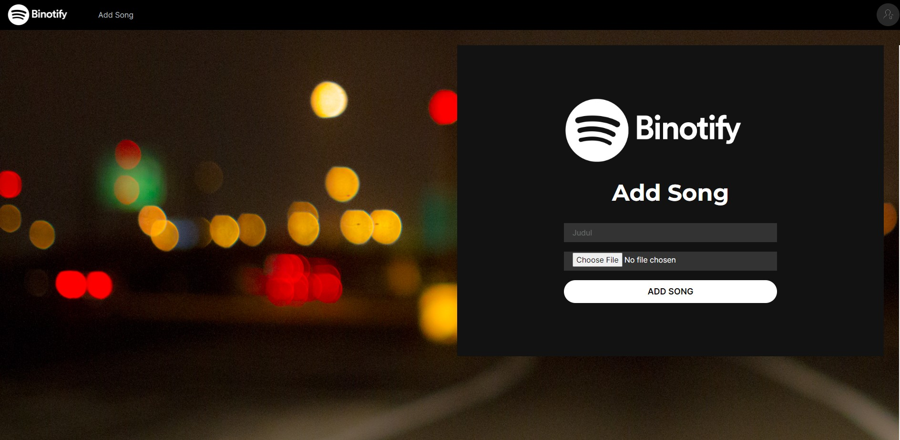

# Deskripsi
Binotify premium adalah sebuah web app yang memanfaatkan REST service untuk membuat sebuah sistem subscription bagi seorang penyanyi. Binotify premium dibangun menggunakan React Javascript dan styling menggunakan Chakra UI.

1. Autentikasi Pengguna
2. Pengelolaan subscribtion request (Admin)
3. Pengelolaan lagu (User)

# Requirement
* Node (npm)
* React
* Chakra UI

# Cara Instalasi
1. Download semua repository yang berhubungan 
2. Pada folder root repo ini, jalankan `npm i` untuk menginstall semua depedencies dari Node

# Cara Menjalankan Server
1. `npm run dev` untuk menjalankan web app
2. Nyalakan semua service yang berhubungan

# Pembagian Tugas
1. Halaman Login : 13520061
2. Halaman Register : 13520148
3. Halaman List Permintaan Subscription : 13520061
4. Halaman Pengelolaan Lagu : 13520085

# Screenshot Program

1. Login

2. Register

3. List Permintaan Subscription

5. Pengelolaan lagu

-Song List
        
-Add Songs

-Edit song

